# ERPNext

---

# Company
<!-- .slide: style="text-align: left;"> -->

---

# Item Group
<!-- .slide: style="text-align: left;"> -->

---

# Item List

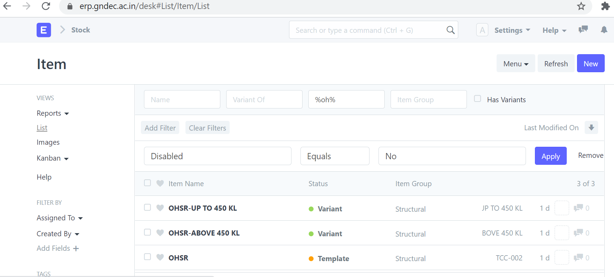

---

# Customer List

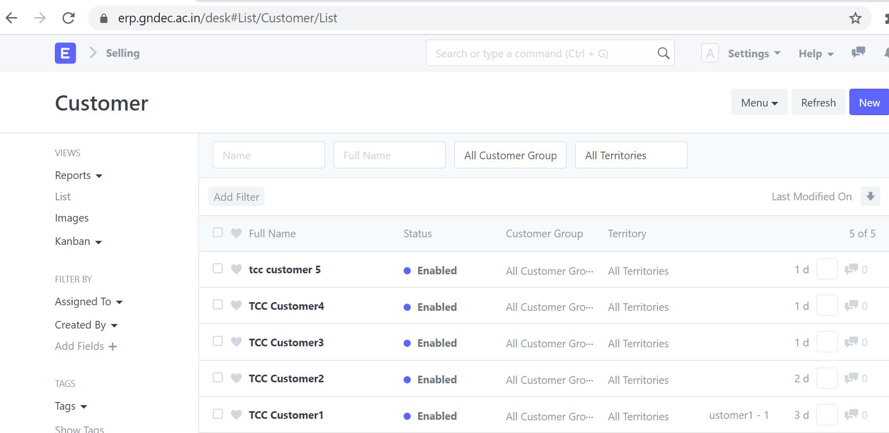

----

# Price List

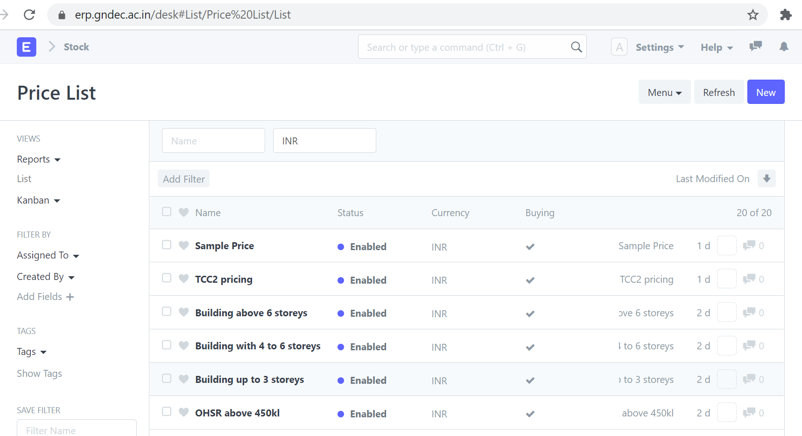

----

# Quotation

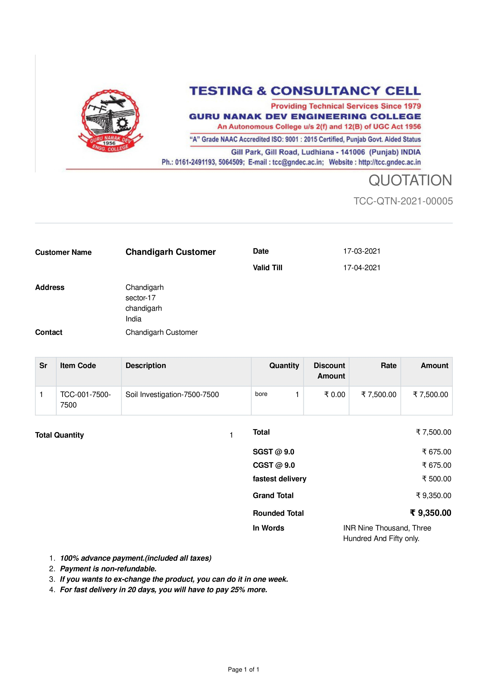

---- 

# Sales order

---

---

# Delivery Note

----

# Payment Request

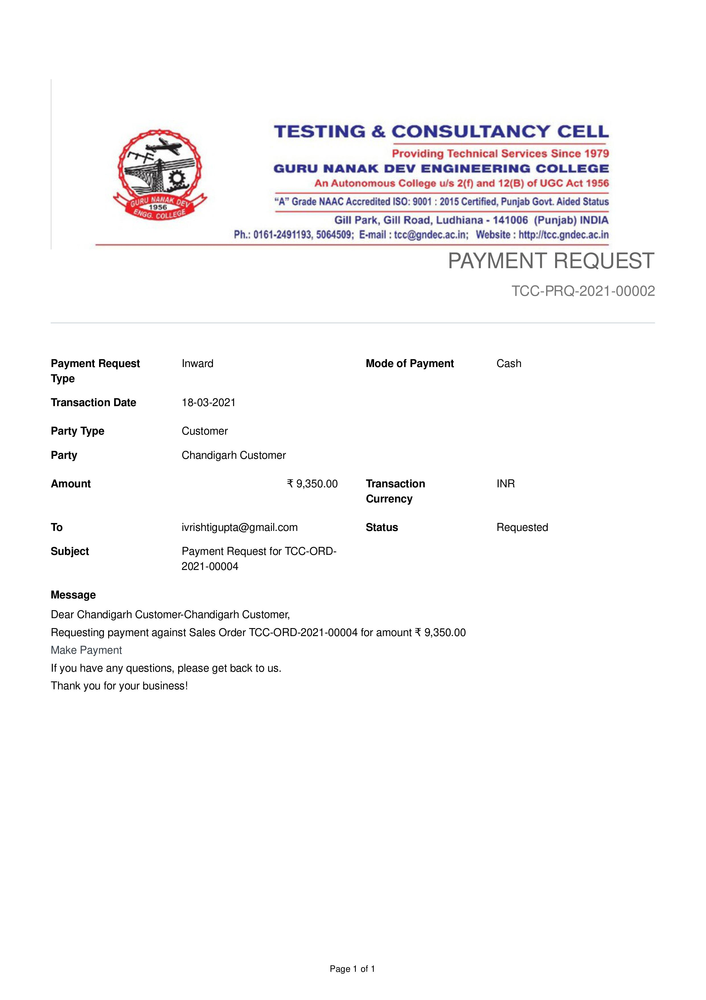
----

# Sales Invoice

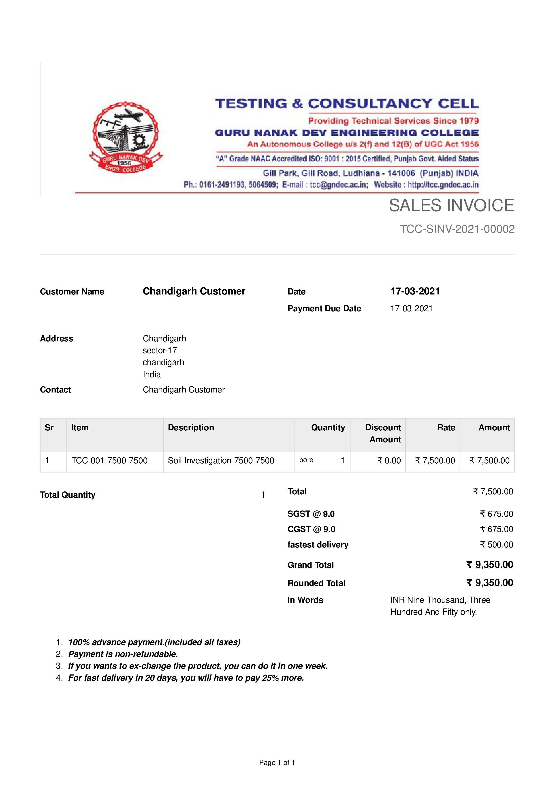
----

# Payment Entry

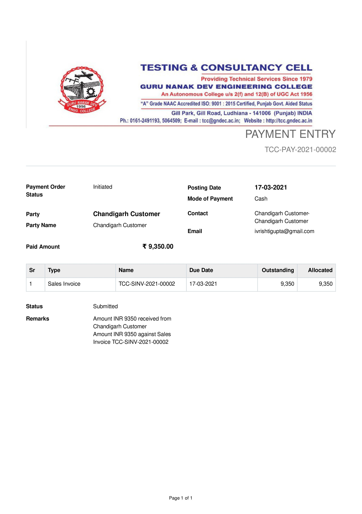
----

# Email

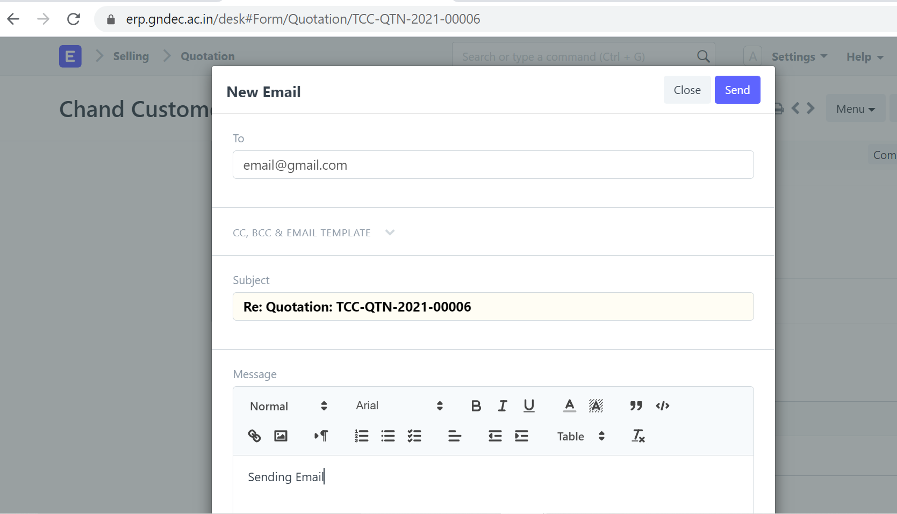
----

# Chart of Accounts

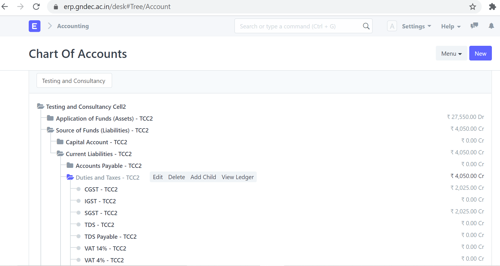

----

## General Ledger
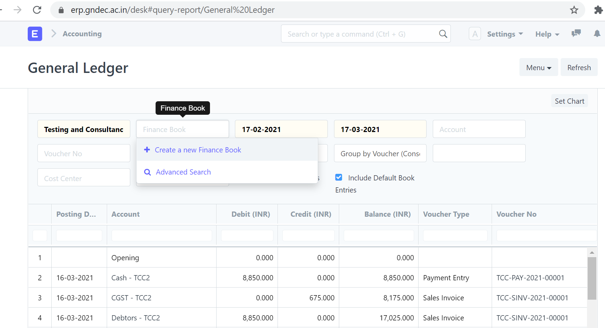

---

# Journal Entry
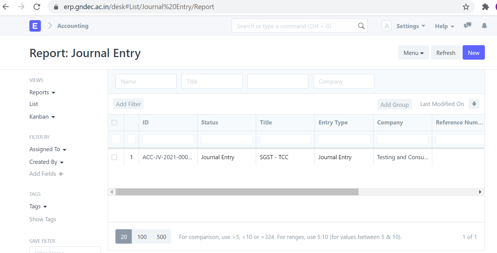

---

# Balance Sheet

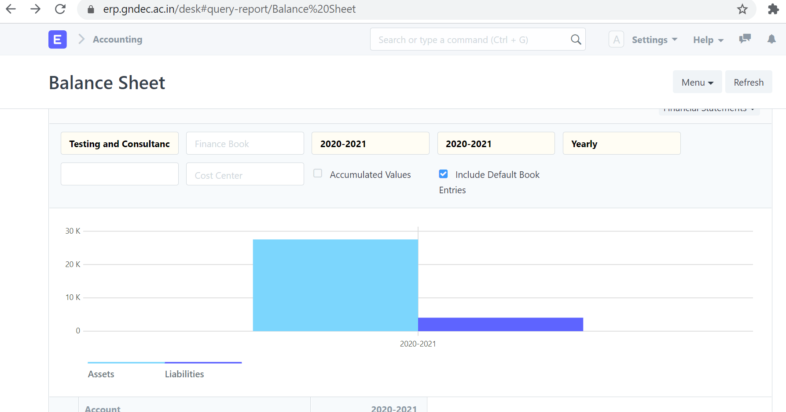

------

 Profit and Loss Statement
 

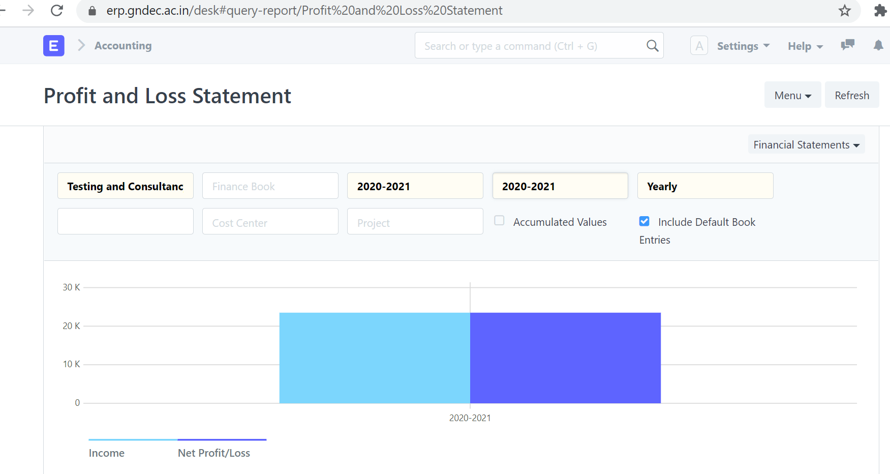

