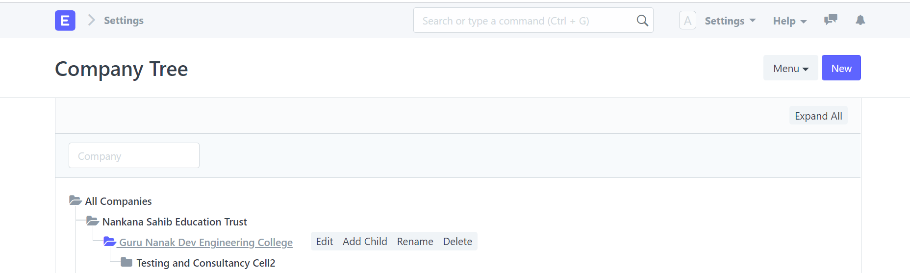

# ERPNext

---

# Company
<!-- .slide: style="text-align: left;"> -->

---

# Item Group
<!-- .slide: style="text-align: left;"> -->

---

# Item List

---

# Customer List

----

# Price List

----

# Quotation

---- 

# Sales order

---

---

Delivery Note

----

# Payment Request

----

# Sales Invoice

----

# Payment Entry

----

# Email

----

# Chart of Accounts

----

## General Ledger

---

# Journal Entry

---

# Balance Sheet

------

 Profit and Loss Statement
 

